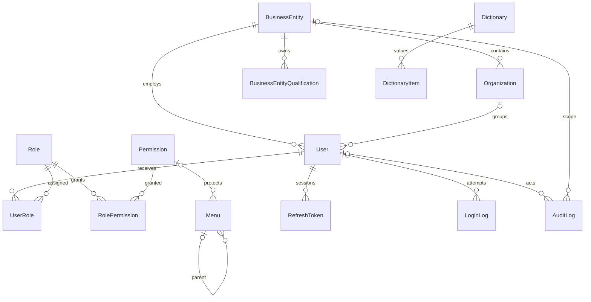
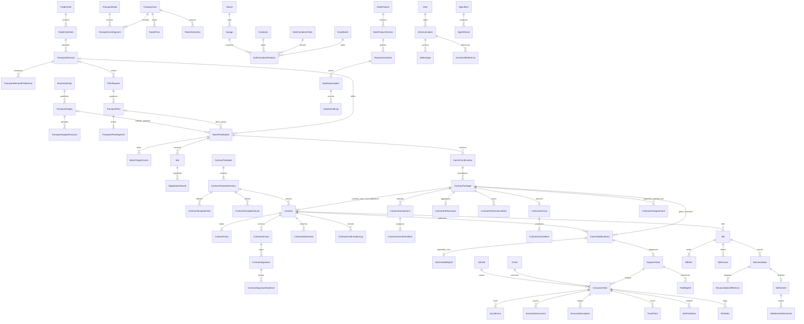

# 需求证据、业务模型与实施地图

日期：2026-10-01。状态：开发依据与规划；实施完成度以阶段验收记录为准。

## 1. 证据与本轮范围

已阅读开发设计规范全文，以及 `docs/requirements` 内六份提取文本：供需管理/多式联运方案/供需匹配大厅、多式联运服务管理、全程可视化/预测预警、对账结算管理、小程序/系统管理/AI智能体中心/数据要素产品、合同管理。用户于本轮更新了独立《合同管理需求规格说明书》V1.0，已完整复读更新后的 `合同管理.txt`。早先合同文件与供需重复的结论仅描述旧文件，现已失效；新的合同需规覆盖开发规范第13节“最小合同闭环”的过渡假设。详见 `contract-update.md`。

主要证据来源：

| 代号 | 来源 | 重点 |
| --- | --- | --- |
| N | `doc/智能多式联运系统开发设计规范.md`，V1.0 | 架构、导航、真实数据、认证、权限、九阶段质量门 |
| D | `docs/requirements/供需管理+多式联运方案+供需匹配大厅.txt`，V1.3 | 交易订单、供需、完整方案、竞价议价、确认承运 |
| E | `docs/requirements/多式联运服务管理.txt`，V1.0 | 组织模式、散改集、执行编排、事件链 |
| V | `docs/requirements/全程可视化+预测预警.txt`，V1.0 | 运行监测、计划实际、ETA、风险 |
| B | `docs/requirements/对账结算管理.txt`，V1.0 | 账单、差异、版本、确认和结算留痕 |
| S | `docs/requirements/小程序+系统管理+AI智能体中心+数据要素产品.txt`，V1.0 | 司机、账号主体、权限、AI与数据产品 |
| C | `docs/requirements/合同管理.txt`，用户更新的独立V1.0 | 两类模板、合同包、两种签署模式、履约、变更、档案 |

**按 N 第 40 节，本轮实施 Phase 1：系统底座 + 顶部导航。** 本文给出完整业务规划，以防底座阻断后续业务；Phase 2–9 为后续阶段，不以菜单数量代替完成度。不生成可点击却没有业务接口的空壳页面。可在数据库保留未来菜单定义和阶段标记，前端应明确其阶段状态。

技术裁决：Vue 3 + TypeScript + Vite + Router + Pinia + Element Plus；NestJS + REST + Swagger；Prisma + SQLite；monorepo。开发规范优先于技能中的 React/shadcn、冷灰主题或侧栏默认建议。布局采用顶部导航、白底、红色主操作、浅灰内容背景。

本轮未读取任何密钥内容。高德和大模型在 Phase 3/7 接入，密钥由环境配置提供。

## 2. 业务对象矩阵

| 对象 | 事实产生者与归属 | 来源 → 后续 | 核心状态与下一步 | 完结事实/限制 |
| --- | --- | --- | --- | --- |
| 企业主体/账号/角色 | 平台维护；账号绑定主体 | 认证 → 所有业务 | 启用/暂停/锁定；平台维护 | 主体状态与角色共同限制访问 |
| 交易订单/明细 | 贸易企业上游系统 | 订单明细 → 运输需求 | 可运输余额；选择未占用量 | 正式需求唯一上游；非本企业不可引用 |
| 运输需求 | 贸易企业 | 订单 → 方案或匹配 | 草稿、已发布、匹配中、议价中、待确认、部分匹配、匹配完成、待重新匹配、已取消 | 全部数量落实才匹配完成；后端原子校验余额 |
| 运输供给/运力资源 | 物流运营商 | 资源能力 → 供给大厅/定向匹配 | 草稿、已发布、暂停、失效 | 仅已发布且有效可被发现；参考价不是成交价 |
| 线路/节点/价格/路径 | 平台或核验接口 | 基础数据 → 求解/地图 | 启停、有效期、来源质量 | 企业只读公共线路价格；几何不得伪造 |
| 求解请求/完整方案/区段 | 业务用户求解，贸易企业选择 | 条件/需求 → 候选 → 完整方案匹配 | 候选、已选择、已发布、失效；重算留版本 | 区段只解释方案，不能独立发布报价 |
| 匹配发布/定向对象 | 贸易企业 | 需求/完整方案/供给反向 → 报价 | 待报价、竞价中/议价中、待确认、已成交、已关闭 | 同需求同时间原则上一个有效发布；定向仅三方可见 |
| 报价/议价轮次 | 物流商报价，双方议价 | 匹配 → 已接受价格 | 有效、修改、撤回、失效、接受/拒绝 | 每次新版本，不覆盖历史；竞争者私有报价不可见 |
| 承运确认 | 发起贸易企业 | 有效协商 → 合同 | 已确认/取消确认 | 人工确认数量、价格、时间；平台不能代替 |
| 合同模板/模板版本 | 平台维护 | 两类当前有效模板 → 合同包 | 草稿/发布版本、启停、生效日期 | 仅运输服务与平台附加两类；已发布版本不可篡改，历史合同不随模板更新 |
| 合同包/主合同/平台附加合同 | 贸易生成，双方确认签署；平台按模式签自身附加协议 | 已确认成交快照 → 生效运输委托 | 草稿、待对方确认、待签署、签署中、生效、拒签、撤回、作废、终止 | 模式A：主合同双方签+附加双方确认；模式B：主合同双方签+附加三方签；缺必签文件不得生效 |
| 合同履约/变更/补充协议 | 任务事实汇总，双方确认变更终止 | 生效合同 → 数量/时效/费用/异常/期限 | 待执行、履约中、部分完成、完成、异常、终止、到期 | 核心条款不能覆盖修改；补充协议按原规则签署；预警不自动判责 |
| 合同档案/签章证据 | 系统归集，主体按权限访问 | 主附合同+成交+签章+变更+履约 → 证据链 | 归集/归档；保留制度配置 | 已签文件不可覆盖；查看/下载/导出亦须审计；普通用户不开放删除 |
| 联运业务/运单 | 承运物流商 | 生效合同 → 分段任务 | 待组织、已组织、待执行、执行中、中转中、完成、终止；异常标识并行 | 一单制保留全程运单；传统模式保留统一业务号 |
| 批次/散改集/装箱关系 | 承运物流商 | 散货且需散改集 → 到场/装箱/后程 | 待集货、集货、待装箱、装箱、封箱、后程关联、完成 | 一批多车、一批多箱、多箱多航次；数量平衡 |
| 车辆/司机/箱/铁路运单/船舶航次 | 承运商配置，接口补充 | 分段 → 执行任务 | 资源可用性、分配与下发记录 | 司机不能自行修改核心资源和业务归属 |
| 执行任务/现场单据 | 承运商下发，司机执行 | 分段 → 现场结果/事件 | 待确认、待装货、已装货、运输中、到达、待签收、完成 | 签收、交付及全部任务完成关闭运输链 |
| EPCIS事件/轨迹/快照 | 移动端、PC、GPS/AIS/铁路接口 | 事件 → 跟踪、ETA、账单证据 | 事件幂等、发生时间、来源、质量 | 执行事件是实际状态依据；可视化不另造状态 |
| 预测/预警/环境/拥堵 | 算法与规则消费事实 | 轨迹/环境 → 任务风险 | 新发生、持续、恢复/解除；置信度和数据时间 | 预测不能取代到达事实；质量不足降级 |
| 账单/明细/版本 | 物流运营商 | 生效合同+可结算执行 → 贸易企业核对 | 草稿、待对账、对账中、差异处理、确认、作废 | 费用字典可配置；修改必须保留版本 |
| 对账/差异 | 贸易企业核对；物流商处理 | 账单 → 已确认对账 | 待对账、对账中、差异、待再次确认、确认、关闭 | 有未解决差异不得确认；平台只能协助 |
| 结算/凭证/双方确认 | 商业双方 | 已确认对账 → 结算归档 | 待结算、部分结算、已结算、异常 | 另一方确认结算结果；不负责实际支付/发票 |
| 数据产品/版本/授权/订阅 | 平台运营 | 已治理数据 → 授权服务/专题 | 草稿、待发布、发布、暂停、下架；授权到期撤销 | 企业无自助申请入口；调用须留痕 |
| AI会话/上下文/运行结果 | 当前用户请求，服务端授权 | 业务上下文 → 辅助结果 | 执行、成功、失败、需人工确认 | 继承业务权限；高影响动作仍由人确认 |

共享业务元数据：`id/businessNo/status/businessEntityId/createdBy/updatedBy/createdAt/updatedAt/deletedAt/sourceType/sourceSystem/sourceRecordId/isTestData`。来源还应记录 sourceTimestamp、ingestedAt、dataQuality。测试样本显式标记，不能描述为生产事实。

## 3. 四类角色权限矩阵

所有“本企业”从服务端会话主体取得；公开、定向、承运、货主和本人任务属于不同授权条件，不能统一用前端 enterpriseId 筛选代替。

| 功能/动作 | 粮食贸易企业 | 物流运营商 | 平台运营方 | 司机 |
| --- | --- | --- | --- | --- |
| PC登录/工作台 | 本企业工作台 | 本企业工作台 | 平台工作台 | 禁止进入PC后台 |
| 系统用户/角色/字典/主体/日志 | 无入口、API拒绝 | 无入口、API拒绝 | 按具体权限维护/审计 | 无权限 |
| 新建/编辑需求 | 本企业；订单数量校验 | 禁止 | 查看治理；不能代替商业确认 | 禁止 |
| 新建/编辑供给 | 禁止 | 本企业 | 查看治理 | 禁止 |
| 查看公开供给 | 已认证用户公开字段 | 已认证用户公开字段 | 全量 | 无后台权限 |
| 查看公开需求/方案 | 公开字段与本企业详情 | 公开字段，可报价 | 全量 | 无权限 |
| 定向匹配 | 发布方 | 仅指定本企业 | 全量查看 | 无权限 |
| 求解/线路价格 | 求解，价格只读 | 求解，价格只读 | 求解及价格维护 | 无权限 |
| 发布需求/完整方案 | 本企业 | 禁止 | 授权辅助，保留实际主体 | 无权限 |
| 报价/还价 | 本企业还价 | 本企业报价/还价 | 只读过程 | 无权限 |
| 私有报价记录 | 本企业需求的全部有效报价 | 仅本企业报价 | 全量查看 | 无权限 |
| 确认承运 | 本企业人工确认 | 不代替贸易企业 | 禁止代替 | 禁止 |
| 合同模板管理 | 菜单/页面/API禁止 | 菜单/页面/API禁止 | 仅两类模板及版本、字段/条款、签署规则、启停维护 | 禁止 |
| 合同签署管理 | 本企业生成包、补字段、提交、签署、撤回未签 | 本企业确认/退回、补本方信息、签署、拒签 | 全量查看、异常/版本问题/作废；模式B签平台自身协议，禁止代企业签 | 任务关联只读字段 |
| 合同履约管理 | 本企业查询、发起/确认变更终止 | 本企业查询、补履约资料、参与变更终止 | 全量查询期限异常；涉及平台条款/费用时按配置确认，不代判责 | 无后台权限 |
| 合同档案管理 | 本企业查询/预览/下载/导出 | 本企业查询/预览/下载/导出 | 按权限全量查询/导出、档案运维 | 无后台权限 |
| 组织、散改集、联运跟踪 | 本企业参与业务只读 | 本企业承运业务维护 | 全量查看、核查纠错 | 无PC权限 |
| 配置资源/下发任务 | 禁止 | 本企业；合同须生效 | 不代替承运调度 | 禁止新建/改主数据 |
| 执行节点/单据/异常 | 查看本企业 | 处理本企业 | 查看核查 | 仅本人已分配任务 |
| 可视化/ETA/预警 | 本企业发起或货主关联 | 本企业承运/组织 | 全量及规则维护 | 本人任务相关反馈 |
| 创建账单 | 禁止 | 本企业可结算业务 | 查看/治理 | 禁止 |
| 差异/对账确认 | 发起差异、最终确认 | 处理差异、版本调整 | 查看协助，不能确认 | 禁止 |
| 结算确认 | 本企业双方确认 | 本企业双方确认 | 监督留痕 | 禁止 |
| 数据产品/授权/订阅 | 无入口、API拒绝 | 无入口、API拒绝 | 唯一管理角色 | 禁止 |
| AI | 本企业与公开数据 | 本企业与公开数据 | 授权平台范围 | 本期无通用AI后台 |

功能权限与主体类型双校验：授予某权限不能让贸易主体变成平台主体；司机角色不能借附加权限进入 PC。平台“全量读”不意味着拥有商业确认写权限。普通用户与企业管理员可用不同权限集合，但都不开放全局系统管理。

## 4. 全链路 Story Map

用户目标：贸易企业将一批已成交粮食安全运抵目的地并确认费用；物流商落实运力、执行交付并完成费用协同；司机执行本人任务；平台维护可信业务环境。

| 发布切片 | 明确运输需求 | 找到并确认承运 | 组织与交付粮食 | 掌握进度与风险 | 核对费用与沉淀数据 |
| --- | --- | --- | --- | --- | --- |
| Phase 1，共同底座 | 登录、主体身份、授权菜单 | 账号角色、数据范围 | 司机身份模型及PC隔离 | 操作/登录审计；AI入口壳层 | 主体、字典、权限配置 |
| Phase 2 | 选择订单明细；核对余额；填时间地址；保存/发布/撤回 | 物流商登记运力；发布/暂停有效供给 | — | — | — |
| Phase 3 | 带入需求或手填求解；核对条件 | 比较完整方案费用/时效/风险；选择版本；核验路径来源 | — | — | — |
| Phase 4 | 发布完整需求/方案 | 公开/定向；报价；还价；接受；确认承运；部分/全部落实 | — | — | — |
| Phase 5 | 穿透订单需求 | 两模板版本；成交生成主附合同包；双方确认；模式A/B签署；完整包生效 | 选择组织模式；分段；散改集；车辆司机；下发；接单；装卸；签收；单据 | 履约数量/时效/异常；变更补充协议；同一事件链更新PC | 合同档案及签章证据；费用关联随Phase8接入 |
| Phase 6 | — | — | GPS/AIS/铁路事件归集 | 任务地图双向联动；计划与实际；时间轴；轨迹回放 | — |
| Phase 7 | AI辅助求解与单据复核 | 业务确认仍由人完成 | 异常结果供业务人员处置 | ETA/拥堵/环境；自然语言问踪；权限继承 | 识别结果人工确认后写入 |
| Phase 8 | — | — | 可结算任务与数量 | — | 物流商制单；贸易核对；差异/版本；再次确认；双方结算；归档；平台产品授权 |
| Phase 9 | 贯通真实上游/导入 | 权限与业务状态全链测试 | 小程序和外部事件联调 | 性能、质量降级、错误恢复 | 全流程审计、部署备份迁移 |

关键交接：报价被接受后仍须贸易企业确认承运；合同签署后须达到生效才可下发；司机签收关闭执行任务，全部分段完成关闭联运业务；贸易企业最终对账确认产生结算依据；结算登记后另一方确认。所有这些终态由业务事件产生，AI和前端都不能直接赋值。

## 5. 信息架构与路由规划

导航：`首页 → 供需管理 → 联运方案 → 供需匹配 → 合同管理 → 联运服务 → 全程可视化 → 对账结算 → 数据服务 → 系统管理`。先权限过滤，再 ResizeObserver 测量宽度与动态 Overflow；保留首页、品牌、用户区，低优先菜单从右侧进入“更多”。恢复宽度后恢复；更多内当前路由必须激活。

每个二级菜单独立路由；普通详情采用 `/:id` 子路由或对象抽屉。Breadcrumb 使用菜单父链和业务对象名称。下面是目标路线规划，不表示均已实现。

| 一级 | 二级/页面 | 建议路由 | 阶段 |
| --- | --- | --- | --- |
| 身份与账户 | 登录、个人资料/改密 | `/login`、`/account` | 1 |
| 首页 | 角色工作台 | `/dashboard` | 1；业务指标随阶段启用 |
| 供需管理 | 运输需求管理、运输供给管理 | `/supply-demand/demands`、`/supply-demand/supplies` | 2 |
| 供需管理关联 | 交易订单选择/详情 | `/supply-demand/trade-orders/:id` | 2；非新增一级菜单 |
| 联运方案 | 求解、线路价格 | `/plans/solve`、`/plans/route-prices` | 3 |
| 供需匹配 | 单页，需求大厅/供给大厅局部视图 | `/matches` | 4 |
| 合同管理 | 合同模板管理 | `/contracts/templates`、`/contracts/templates/:id` | 5；仅平台 |
| 合同管理 | 合同签署管理 | `/contracts/signing`、`/contracts/signing/:id` | 5；三PC按合同方隔离 |
| 合同管理 | 合同履约管理 | `/contracts/performance`、`/contracts/performance/:id` | 5；费用联动8 |
| 合同管理 | 合同档案管理 | `/contracts/archives`、`/contracts/archives/:id` | 5；三PC按合同方隔离 |
| 联运服务 | 联运组织管理 | `/intermodal/organization` | 5 |
| 联运服务 | 散改集管理 | `/intermodal/bulk-container` | 5 |
| 联运服务 | 联运跟踪，包含执行编排 | `/intermodal/tracking` | 5 |
| 全程可视化 | 运行总览 | `/visibility/overview` | 6 |
| 全程可视化 | 全程跟踪/任务详情 | `/visibility/tracking`、`/visibility/tracking/:id` | 6 |
| 全程可视化 | 预测预警 | `/visibility/alerts` | 7 |
| 全程可视化 | 专题视图，公铁水局部切换 | `/visibility/themes` | 6 |
| 对账结算 | 账单管理、对账管理、结算管理 | `/finance/bills`、`/finance/reconciliations`、`/finance/settlements` | 8 |
| 数据服务 | 产品目录、授权管理、订阅调用、专题应用 | `/data/products`、`/data/authorizations`、`/data/subscriptions`、`/data/applications` | 8；仅平台 |
| 系统管理 | 用户管理、角色权限、数据字典、合作主体、日志管理 | `/system/users`、`/system/roles`、`/system/dictionaries`、`/system/entities`、`/system/logs` | 1；仅平台 |
| 司机端 | 我的任务、任务详情/执行、单据、异常、消息、个人 | 小程序独立 routes/pages，非PC菜单 | 5 |
| AI | 右下角悬浮入口与抽屉 | 页面上下文唤起，无一级菜单 | 1壳层/7业务 |

列表契约：筛选区只含查询/重置，新增在工具栏；有分页、空态、加载、错误重试；输入失败保留；危险操作二次确认。详情说明来源、状态、下一动作、上游下游和历史。跨模块业务链使用真实关联ID。

检索维度采用统一字典：运输方式、粮食品种、装载方式、状态、异常/风险、单据、费用、结算方式、数据产品主题；时间/主体/地域是过滤维度。导航名称来自需求规范，尚未做真人卡片分类或首击测试。

## 6. Phase 1 系统管理字段与认证契约

### 6.1 字段

| 管理对象 | 最低字段与规则 |
| --- | --- |
| 用户 | 用户编号、唯一登录账号、姓名、手机号、可选邮箱、启用/禁用状态、主体ID/类型、可选组织部门、多角色关系、数据范围、司机标识/资质引用、所属物流商、最近登录、密码重置标识、锁定标识、创建/修改人和时间；删除优先软删除 |
| 角色 | 唯一代码、名称、四类角色类型、说明、状态、数据范围；独立用户角色及角色权限关系；不可跨主体类型滥授 |
| 权限 | 唯一代码、名称、模块、类型（菜单/页面/按钮/API/数据/移动/AI）；写权限与读权限分离 |
| 菜单 | 名称、路由、父项、排序、Overflow优先级、权限要求、状态/阶段；数据库驱动；深链同样鉴权 |
| 企业主体 | 编号、名称、类型、统一社会信用代码、状态、联系人/电话/地址；物流商服务区域/运输方式/能力/资源说明；资质名称/有效期/附件 |
| 主体合作状态 | 待启用、正常、暂停、终止；不能把所有主体状态压缩为任意前端布尔值 |
| 组织部门 | 主体内可选树；用户部门仅能属于同一主体 |
| 字典 | 分类、编码、名称、排序、状态；业务状态显示名可以字典化，但转移规则仍由服务端控制 |
| 登录日志 | 用户/尝试账号、主体、角色、成功失败、错误原因、IP、终端、时间、requestId；不保存密码/Token |
| 审计日志 | 用户、主体、角色、模块、对象类型/编号、动作、原状态、新状态、结果/错误、时间、IP、终端、requestId；记录权限修改和数据修改，不能随业务删除丢失 |

### 6.2 必须实现与实现建议

规范明确要求：登录、退出、Access Token、Refresh Token、当前用户、修改密码、平台重置密码、Token失效、用户状态、最后登录、LoginLog；密码使用 bcrypt 或 argon2。

实现建议（技术选择，不属于文档新增业务承诺）：短期 Access JWT + 可撤销刷新会话；数据库只存刷新Token摘要；刷新轮换及重用拒绝；退出撤销本会话，改密/重置密码/禁用后使相关会话失效；受限浏览器 cookie 配合明确 CORS 策略；敏感请求不把凭据写日志。每次授权重新验证账号/主体有效性与权限版本，避免长时间沿用已被撤销的权限。

Phase 1 必须有企业A/B样例，以实际接口验证跨企业隔离；只有三种不同菜单还不足以证明数据权限。业务 Service 的查询条件由服务端合成；客户端主体参数只能进一步收窄，不能扩大范围。

### 6.3 API 模块与动作

统一返回 `code/message/data/timestamp/requestId`；分页 `page/pageSize/total/items`；ValidationPipe、ExceptionFilter、AuthGuard、PermissionGuard、DataScope、RequestLog、AuditLog、Swagger 统一配置。

| 阶段 | API模块 | 核心动作 |
| --- | --- | --- |
| 1 | `/api/auth/*` | login、refresh、logout、me、change-password；验证PC身份 |
| 1 | `/api/users/*` | 分页/过滤/排序/详情/新增/修改/软删除/状态/角色关联/重置密码 |
| 1 | `/api/roles/*`、`/api/permissions/*` | 角色CRUD、权限目录与权限赋予；角色类型约束 |
| 1 | `/api/menus/*` | 当前用户可见菜单；平台维护菜单配置 |
| 1 | `/api/entities/*`、`/api/organizations/*` | 主体/部门管理与权限内查询 |
| 1 | `/api/dictionaries/*`、`/api/logs/*` | 字典维护；登录/审计/变更/接口日志查询 |
| 1 | `/api/dashboard/*` | 只返回当前阶段真实数据库指标与角色信息 |
| 2 | `/api/trade-orders/*`、`/api/transport-demands/*`、`/api/transport-supplies/*` | 订单引用、数量占用、CRUD、发布/撤回/暂停/失效 |
| 3 | `/api/transport-nodes/*`、`/api/transport-lines/*`、`/api/route-prices/*`、`/api/transport-plans/*` | 节点核验、线路价格、路径缓存、求解/重算/选择完整方案 |
| 4 | `/api/matches/*`、`/api/bids/*`、`/api/negotiations/*`、`/api/carrier-confirmations/*` | 公开/定向发布、历史版本、接受/拒绝、人工确认承运 |
| 5 | `/api/contract-templates/*` | 平台专属；两模板类型、版本复制/预览/发布/启停/生效日期、变量可编辑性、条款及A/B签署规则 |
| 5 | `/api/contract-packages/*`、`/api/contracts/*` | 成交幂等生成主附合同包；锁定成交/模板快照；补充授权字段、提交/退回/确认、撤回/拒签/作废、检查包生效 |
| 5 | `/api/contract-signatures/*` | 指定本人主体的签署会话/附加确认；服务商回调验签幂等；证书/文件hash/版本证据；平台仅签自己的模式B附加协议 |
| 5 | `/api/contract-performance/*`、`/api/contract-amendments/*` | 数量时效异常期限聚合；变更前后值、补充协议、原规则签署、双方终止；费用只读关联Phase8 |
| 5 | `/api/contract-archives/*` | 包级归档、预览/下载/清单导出、关联成交/签章/变更/履约证据；访问亦审计、文件不可覆盖 |
| 5 | `/api/intermodal-businesses/*`、`/api/intermodal-waybills/*`、`/api/segment-tasks/*`、`/api/bulk-container/*` | 组织模式、区段、批次/车/箱/船关系 |
| 5 | `/api/execution-tasks/*`、`/api/execution-events/*`、`/api/driver/*` | 配置、下发、本人接单、执行节点、单据异常；关键动作幂等 |
| 6 | `/api/tracking/*`、`/api/ingest/gps`、`/api/ingest/ais`、`/api/ingest/rail-event`、`/api/ingest/epcis`、`/api/ingest/mobile-event` | 来源身份、幂等键、时序、轨迹、事件聚合；HTTP兜底+SSE/WS |
| 7 | `/api/eta/*`、`/api/alerts/*`、`/api/agents/*`、`/api/ai/conversations/*`、`/api/documents/recognize` | 权限内上下文、预测质量、辅助结果、人工确认与调用审计 |
| 8 | `/api/bills/*`、`/api/reconciliations/*`、`/api/settlements/*` | 可结算检查、明细版本、差异、确认、结算留痕 |
| 8 | `/api/data-products/*`、`/api/data-authorizations/*`、`/api/data-subscriptions/*` | 版本、生命周期、范围期限、服务调用记录 |

后续模块使用动作接口推进状态，不能接受任意 `PATCH status` 绕过当前状态、主体、业务前置条件。平台商业动作禁令必须单独测试。

## 7. 数据库 ER 第一版

### 7.1 Phase 1 关系

SystemConfig 保存非秘密平台配置；真实服务密钥不进入公共配置返回值。RolePermission、UserRole 建联合唯一约束；User.username、Role.code、Permission.code、主体编号、菜单路由/代码建唯一约束；审计记录保留操作者/主体快照供账号删除后追踪。RefreshToken 至少有摘要、过期、撤销、用户/会话引用。

### 7.2 业务全链关系

图仅表示主要关系。补充实体包括 VehicleLatestLocation、VesselTrackPoint、VesselLatestLocation、RailTransportEvent、TransportStatusSnapshot、PortCongestionSnapshot、EnvironmentRiskEvent、AgentExecutionLog。一账多任务需显式 BillTask 关联；任务批次/箱关系需显式关联表；不能把多车/多箱压进单字段。高频 TrackPoint 单独存储，按对象与时间索引。金额使用最小币种单位或明确精度定点值；数量明确单位和精度，避免浮点累计影响余额校验。关键数量占用、承运确认和账单生成采用事务及唯一约束防重复。

新版合同约束：合同包是签署和生效聚合对象，主合同、附加合同分别有类型/模板版本/文件版本/状态；模板类型固定两种，模板实例和版本可多条。每次成交仅一个当前有效合同包；核心成交变化导致未签包作废后重新生成时保留代次与前包关系，不能覆盖旧包。生效必须校验两文件完整、模式快照的全部必签/必确认主体和已锁定版本。任务同时关联合同包与主合同，不能只看主合同已签就下发。签章记录绑定具体文件版本与摘要；平台服务费独立于运输运费。平台费字段至少有收取开关、收费对象/方式、费率或单价、金额、支付节点、含税属性/开票要求与调整说明。

## 8. 阶段质量门

| 阶段 | 必须证明的业务事实 |
| --- | --- |
| 1 | 三类PC登录不同菜单；司机PC拒绝；角色改权后生效；企业直调平台API拒绝；主体隔离；1280/1440动态更多及恢复；SQLite写入刷新和API重启仍在 |
| 2 | 贸易从订单生成需求；物流不能创建需求；供给真实CRUD；跨企不可修改；超量后端拒绝 |
| 3 | 需求自动带入/菜单空输入；候选可比较；真实公路geometry；缓存可复用；无铁路水运数据时不伪造 |
| 4 | 两物流商独立报价且互不可见；多轮议价；贸易确认；定向业务其他企业API拒绝 |
| 5 | 合同四菜单权限；仅两模板类型且历史版本保留；成交生成主附合同包；A/B完整签署条件；缺附加/缺平台必签不得生效；未生效包不得下发；签章真实证据；变更不可覆盖；履约台账与档案访问审计；两种组织模式；一批多车/箱；司机本人接单；执行回写PC |
| 6 | 真底图；任务/地图联动；后端轨迹；业务穿透；来源与时间；缺AIS不标实时 |
| 7 | 页面上下文唤起；AI企业隔离；结果链接；低质量提示；不能自动确认承运/派车/结算 |
| 8 | 制单/差异/新版本/确认/部分结算/双方确认；平台只读商业确认；数据服务仅平台 |
| 9 | 从贸易订单需求到最终结算全链；权限、性能、文件上传、错误恢复、备份与部署 |

各阶段需 migration、seed/导入、启动真实API/Web、Swagger、真实浏览器 Playwright、Console/API错误检查、数据库检查、刷新、重启、权限验证。构建成功不等于验收通过。

## 9. 冲突、缺口与裁决

| 事项 | 证据/冲突 | 裁决与后续集成缺口 |
| --- | --- | --- |
| 合同需规已更新 | 新C提供独立需规；N §13仍描述旧重复文件/最小闭环 | 按明确业务需规优先，新C覆盖旧过渡边界；Phase5扩展四功能、两模板、主附合同包、电子签署、履约变更与档案；电子签章服务接入仍待提供 |
| 合同发票/费用字段 | C包含发票要求、账户、含税属性、平台服务费；B/N禁止开票支付流程 | 合同支持约定字段及条件显示；保持合同平台费与运费分离；对账结算仍不建设开票/税务/在线支付/资金托管 |
| 平台签署权限 | 原概括“平台不能代签”；C模式B要求平台参与附加三方签章 | 平台只能作为自己的附加协议签署方，不代企业签主合同；更细权限与文件类型/签署主体校验 |
| 档案议价证据范围 | C归档各方报价；D限制竞争者报价/身份 | 档案保存完整证据，但预览下载导出继承源记录权限；物流商只见本方议价及共同成交事实，不能绕过竞价隐私 |
| 生效后任务门禁 | C §6.3提到可配置先组织后补签例外；N禁止未生效下发 | C未要求默认启用例外；当前保留严格完整包生效后正式执行，不自行开放绕过开关 |
| 模板法律文本与签署方案 | C要求法律审定，A/B最终模式由法务/运营/签章方案共同确定 | 系统支持两模式，发布模板前取得审定正文与规则；用户最新明确采用模拟电子签章；本轮展示模拟标识、正文摘要和各方操作记录，不生成第三方电子证书 |
| 菜单名称 | 需规长名与N短名不同 | UI用“联运方案/供需匹配/联运服务/全程可视化/对账结算/数据服务”；对象语义不变 |
| AI中心入口 | S建议单入口；N明确悬浮小人 | 悬浮入口+抽屉，不新增一级菜单；Phase1只壳层 |
| 视觉/组件技能 | 技能通用默认可能用侧栏、shadcn、冷灰 | 用户规范的顶部红白、Vue+Element Plus优先 |
| 需规状态文字 | 执行“已接单/待执行”与规范“待装货”；异常曾列主状态 | 存明确事件与阶段；展示词映射；异常并行标识，避免丢失实际执行进度 |
| 账单状态 | B §6草稿至已作废；§12写待再次确认/已关闭 | 区分账单状态与对账状态；再次确认属于对账；作废关闭语义需Phase8具体状态表统一 |
| 手工求解正式匹配 | D允许明确发布主体后发布；N强调需求来自订单 | 求解可无需求；正式匹配须校验贸易主体与完整业务信息；是否必须补挂订单需求在Phase4明确，不能让查询方案悄然成为正式需求 |
| 部分承运 | D允许按规则多家分担；完整方案原则上一家 | 数量拆分与区段拆分分离；完整方案整体承接，启用多家数量分担前明确规则 |
| 订单系统 | 有唯一来源规则，无接入协议/脱敏数据 | Phase2数据库样例显式TEST；保留sourceSystem/sourceRecordId，之后接真实交易接口 |
| 物流数据 | 未提供GPS/AIS/铁路/环境接口合同 | Phase6建立正式ingest，开发模拟器隔离；来源真实前不展示实时生产轨迹 |
| 高德服务权限 | 有本地凭据但服务授权未验证 | Phase3再验证正式路线能力；通用道路明确profile，不能称货车限行路线 |
| AI质量 | 六种能力有描述，无训练/评估基线 | Phase7对接后验证、继承权限、降级；不能承诺无数据高精度ETA |
| 微信小程序 | 未提供AppID、发布/审核环境 | 用户最新明确采用电脑浏览器模拟小程序；Phase5实现独立司机浏览器入口 `/driver`，微信原生构建和发布不在本轮范围 |
| 上传、通知、外部订阅 | 需规描述文件/消息/API，无服务配置 | 后续补存储与访问控制、文件校验、通知渠道、授权凭据及限流；不伪造已发送 |
| 账号安全策略 | 明确锁定与重置标记，未给次数/时长策略 | Phase1采用可配置默认与审计；生产策略需运营确认，无需阻断底座开发 |

## 10. Reality-check log 与证据覆盖

| 假设 | 业务事实 | 模型 | 判定 | 模式 |
| --- | --- | --- | --- | --- |
| 方案区段可分别竞价 | 匹配对象始终是完整需求或完整方案 | implementation | overturned | P-04/P-05 |
| 报价接受等于成交 | 仍须贸易企业确认承运，且数量全部落实才匹配完成 | implementation | overturned | P-01/P-12 |
| 平台管理者能代确认任何业务 | 平台可全量查看，模式B可签自己作为当事方的附加协议；不能代商业主体确认承运/主合同/对账 | implementation | overturned | P-06/P-12 |
| 主合同双方签完就能派车 | 合同包还须完成平台附加合同对应A/B模式的确认签署，整体生效后才开放正式执行 | implementation | overturned | P-04/P-12 |
| 联运跟踪和全程跟踪重复 | 前者组织执行，后者监测分析 | implementation | refined | P-03/P-14 |
| 结算完成意味着平台付款 | 平台只记录双方结算结果，实际付款在既有渠道 | implementation | overturned | P-05/P-06 |
| 菜单足够多就算系统完成 | 验收基于业务事件、持久化、权限、真实浏览器 | represented | overturned | P-05/P-10 |
| 用户希望看到这些导航词 | 文档规定了词汇，尚无真人可用性观察 | mental | refined | P-14 |

本轮覆盖供需到结算全生命周期、四角色、管理字段、九阶段、状态与外部依赖，并已纳入用户更新的独立合同需规。仍未取得生产业务数据、审定合同正文、电子签章服务协议/配置、真人访谈/树测试和外部接口协议；上述缺口不影响Phase1，但限制后续生产验收。未发现需要改写共享技能Pattern Base的新通用模式，现有P-01/P-05/P-06/P-12/P-14已覆盖本轮判断。
