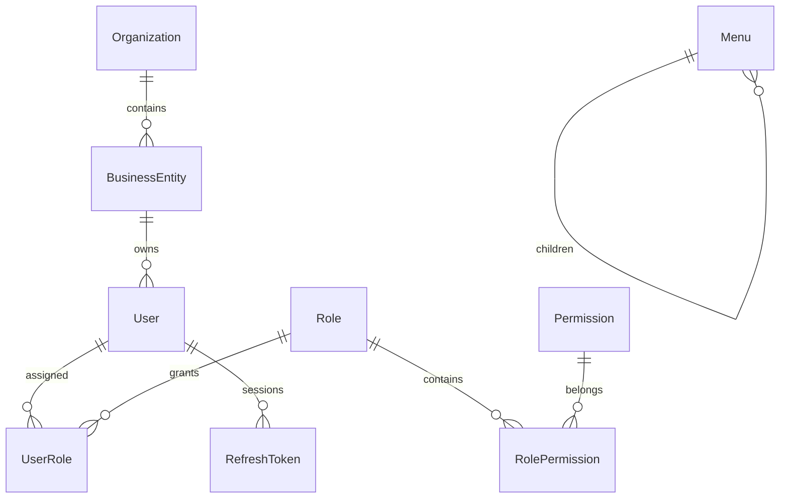

# Phase 1 数据库

数据库：Prisma ORM + SQLite；实际 schema 为 `prisma/schema.prisma`，迁移为 `prisma/migrations/`。

另外包含 LoginLog、AuditLog、Dictionary。审计表保存操作者名称、角色与主体ID快照，而非通过级联删除失去历史。

## 约束

- 用户账号、角色code、权限code、主体name、菜单path分别唯一。
- UserRole 与 RolePermission 使用联合主键，防止重复授权。
- Dictionary 在 group/code 上唯一。
- RefreshToken 仅保存随机token的SHA-256，access token绑定其session ID。
- User 和 BusinessEntity 软删除；角色引用关系保持外键完整。
- 权限变更、新增/编辑/删除与 AuditLog 在同一事务提交。
- 业务数据不存储于浏览器。浏览器只在内存保存Access Token，Refresh Token使用HttpOnly Cookie。

后续阶段逐步新增交易、联运、合同包、执行事件等领域模型，详见 `docs/architecture/requirements-map.md`。本轮未创建无实际业务实现的占位业务表。
